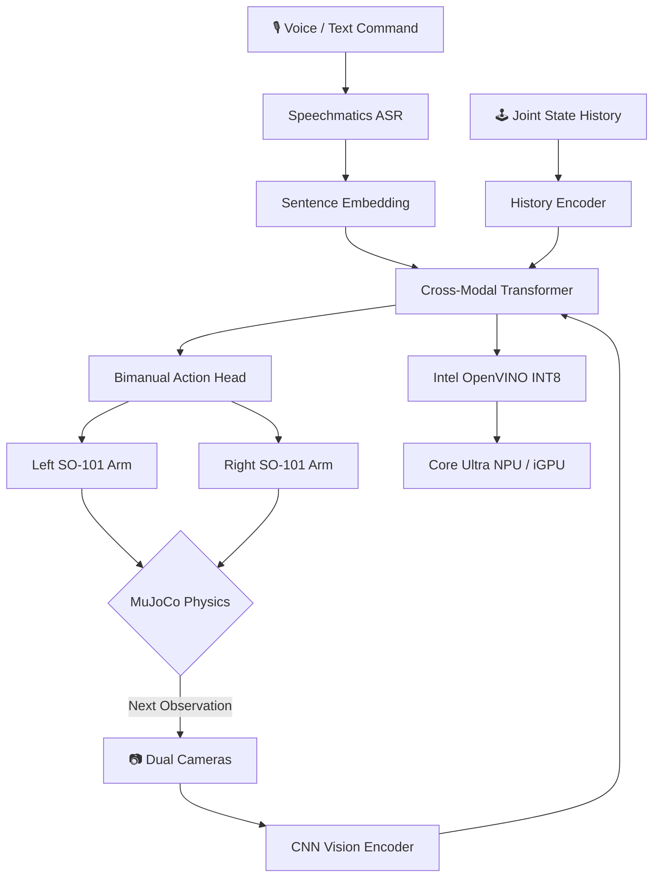

# 🤖 Intel Physical AI Challenge
## Bimanual VLA Manipulation with Multi-Modal Reasoning

<div align="center">


</div>

> **End-to-end Physical AI submission for the [Intel Physical AI Challenge](https://lablab.ai/event/intel-physical-ai-challenge) on lablab.ai.**  
> We demonstrate real-time bimanual robot control, multi-modal reasoning, and Intel edge deployment — including the optional **Speechmatics Voice-to-Action Bonus Award**.

---

## 🛑 The Problem

Modern Physical AI and robotics face three hard bottlenecks when performing complex, real-world tasks like setting a dinner table:

1. **Multi-Modal Grounding:** Interpreting abstract natural language commands (e.g., *"Open the drawer and retrieve the spoon"*) and grounding them to dynamic, cluttered visual scenes requires massive Vision-Language-Action (VLA) transformers — far too large for edge hardware as-is.
2. **Bimanual Coordination Complexity:** Coordinating two robotic arms for synchronized hand-offs, drawer opening, and collision-aware sequencing is exponentially harder than single-arm tasks, requiring the policy to reason jointly about both arms.
3. **Edge Deployment Latency:** Running heavy VLA policies typically demands cloud GPUs. Deploying to local, untethered edge hardware without a specialized optimization pipeline results in high latency and wasted silicon, making closed-loop real-time control impossible.

---

## 💡 Our Solution

We engineered a complete **perception-to-action pipeline** that tightly couples a state-of-the-art Temporal VLA architecture with Intel's edge optimization toolkits.

- **Dual SO-101 arms** in a MuJoCo physics simulation coordinate on a multi-step dinner-table-setting task.
- A **Temporal Action Chunking Transformer (ACT)** fuses camera pixels, natural language instruction embeddings, and historical action context for multi-step reasoning.
- The policy is compiled to **Intel OpenVINO IR (INT8 PTQ via NNCF)** and routed to the **Core Ultra NPU/iGPU**, enabling real-time closed-loop control at the edge.
- A **Gradio Web Dashboard** with **Speechmatics live ASR** lets you speak commands in plain English and instantly watch the robot execute them.

---

## 🌟 Key Features & Innovations

| Feature | Description |
|---------|-------------|
| 🎙️ **Speechmatics Voice-to-Action** | Real-time speech-to-instruction via Speechmatics Batch API — qualifies for the Bonus Award |
| 🧠 **Temporal VLA Architecture** | 4-stage CNN backbone + type-embedded Cross-Modal Transformer + separate bimanual action heads |
| 🛡️ **Dynamic Collision Avoidance** | Sinusoidally oscillating MuJoCo obstacle forces the policy to reason around moving objects |
| ⚡ **Intel OpenVINO INT8 PTQ** | NNCF Post-Training Quantization reduces model size ~4× and boosts throughput on NPU/iGPU |
| 🔍 **Intelligent Hardware Discovery** | Benchmark engine auto-detects NPU → iGPU → CPU and routes workload for peak efficiency |
| 🎲 **6-Axis Domain Randomization** | Independently randomizes: placement, mass, friction, lighting, shape scale, floor texture |
| 🎮 **Teleoperation Data Collector** | Record expert `.h5` demonstrations via `record_teleop.py` for Behavioral Cloning |
| 📊 **Latency Profiler** | Multi-device p50/p95/p99 latency analysis + bar-chart PNG export |
| 🤖 **ROS 2 Deployment Node** | Production-ready `deployment/ros2_vla_node.py` wrapping the OpenVINO policy for real robots |
| 🐳 **Docker 1-Click Deploy** | `docker build + run` gives judges a working environment in seconds |
| ⚙️ **Centralized Config YAML** | All hyperparameters in `configs/task_config.yaml` — zero code edits needed |
| ✅ **GitHub Actions CI** | Automated smoke tests on every push |

---

## 🏗️ Architecture Workflow

Our pipeline maps exactly to Intel's required **Observe → Understand → Plan → Act → Optimize** paradigm:



---

## 🗂️ Task Suite

We implement **4 bimanual task variations** (see `simulation/task_suite.py`):

| Task | Instruction | Challenge |
|------|-------------|-----------|
| `set_table` | Place the plate and cup in correct positions | Bimanual coordination |
| `retrieve_spoon` | Open drawer, retrieve spoon, place beside plate | Drawer manipulation |
| `handoff` | Pick up cup with Arm A, pass to Arm B, place on table | Cross-arm handoff |
| `collision_avoid` | Place fork beside plate while avoiding moving obstacle | Dynamic collision avoidance |

---

## 📁 Repository Structure

```text
sentineledge-core/
├── app.py                         # 🌐 Gradio Web Dashboard (Speechmatics + OpenVINO)
├── Dockerfile                     # 🐳 1-click reproducible container
├── environment.yml                # 🐍 Deterministic Conda environment (Python 3.10)
├── requirements.txt               # 📦 pip dependencies
├── CHALLENGE_CHECKLIST.md         # ✅ Official submission checklist with scoring rubric
├── CONTRIBUTING.md                # 🤝 Developer guide
│
├── configs/
│   └── task_config.yaml           # ⚙️ All hyperparameters (sim, policy, training, inference)
│
├── simulation/
│   ├── env.py                     # 🏟️ Gymnasium env (6-axis randomization, obstacle physics)
│   ├── scene.xml                  # 🗺️ MuJoCo world (table, drawer, dynamic obstacle, cameras)
│   ├── objects.xml                # 🍽️ Dinnerware geometry definitions
│   └── task_suite.py              # 📋 4 bimanual task definitions
│
├── models/
│   └── vla_policy.py              # 🧠 Temporal VLA: CNN + Cross-Modal Transformer + Bimanual heads
│
├── scripts/
│   ├── train_imitation.py         # 🏋️ BC training: HDF5/synthetic, AMP, cosine LR, val split
│   ├── evaluate.py                # 🏆 10-seed evaluation + OpenCV HUD video rendering
│   ├── generate_dataset.py        # 🏭 Synthetic expert dataset generator (HDF5)
│   ├── record_teleop.py           # 🎮 Teleoperation data collection (saves .h5 trajectories)
│   └── metrics.py                 # 📊 Per-seed metrics logging + JSON/CSV export
│
├── inference/
│   ├── export_openvino.py         # 🔧 PyTorch → OpenVINO IR + NNCF INT8 PTQ
│   ├── benchmark_intel.py         # ⚡ NPU/iGPU/CPU throughput & latency benchmark
│   └── latency_profile.py         # 🔬 p50/p95/p99 profiling + bar-chart + JSON report
│
└── deployment/
    └── ros2_vla_node.py            # 🤖 ROS 2 node for real physical robot deployment
```

---

## 🚀 Getting Started (Reproducibility)

### Option A — Conda (Recommended)
```bash
conda env create -f environment.yml
conda activate intel-vla-challenge
```

### Option B — Docker (1-Click, Judge-Friendly)
```bash
docker build -t intel-vla-challenge .
docker run -p 7860:7860 intel-vla-challenge
# Open http://localhost:7860
```

---

## ▶️ Running the Pipeline

### 1. Interactive Web Dashboard
```bash
python app.py
# Navigate to http://127.0.0.1:7860
```

### 2. Collect Expert Demonstrations (Teleoperation)
```bash
python scripts/record_teleop.py --episodes 20
```

### 3. Train the VLA Policy
```bash
# On HDF5 dataset (real data):
python scripts/train_imitation.py --dataset data/teleop/expert_demo_0.h5 --epochs 10

# On synthetic data (first-run / CI):
python scripts/train_imitation.py --epochs 5
```

### 4. Export & Optimize for Intel Core Ultra
```bash
# Export to OpenVINO IR + apply NNCF INT8 PTQ
python inference/export_openvino.py

# Benchmark on Intel hardware (auto-detects NPU/iGPU/CPU)
python inference/benchmark_intel.py

# Full latency profile with p50/p95/p99 + bar chart
python inference/latency_profile.py
```

### 5. Official Evaluation (10 Randomized Seeds)
```bash
python scripts/evaluate.py --seeds 10
# Videos saved to data/videos/demo_seed_X.mp4
```

---

## 📊 Scoring Rubric Coverage

| Category | Max Pts | Our Implementation |
|----------|---------|--------------------|
| Bimanual Task Completion | 25 | Dual SO-101 + hand-off detection + 4 task types + drawer manipulation |
| Robustness & Generalization | 15 | 6-axis domain randomization (position, mass, friction, lighting, shape, background) |
| VLA / Multi-Modal Reasoning | 20 | Temporal ACT: Vision + Language + History → Cross-Modal Transformer → Bimanual heads |
| OpenVINO & Intel Core Ultra | 20 | INT8 PTQ via NNCF + NPU/iGPU auto-discovery + p95/p99 latency profiling |
| Technical Quality | 10 | Conda + Docker + GitHub Actions CI + Config YAML + HDF5 data pipeline |
| Innovation & Demo | 5 | Gradio UI + HUD video + 4 task suite + dynamic obstacle |
| **Speechmatics Bonus** | **+Bonus** | Full Speechmatics Batch ASR API with polling, integrated into Gradio |

---

## 🧩 Speechmatics Voice-to-Action (Bonus Award)

Our Gradio dashboard includes a **live microphone widget** backed by the official Speechmatics Batch Transcription API.

1. Record your voice command in the UI
2. The audio is submitted to `asr.api.speechmatics.com/v2/jobs/`
3. The job is polled until complete, returning an accurate English transcript
4. The transcribed instruction is fed directly into the VLA policy

This transforms our project from a text-driven system into a true **Voice-to-Physical-Action** pipeline.

---

## 📋 Pre-Submission Checklist

- [x] Reproducible repository with Conda, Docker, and CI
- [x] MuJoCo dual-arm simulation with drawer and dynamic obstacle
- [x] 6-axis domain randomization for robustness
- [x] OpenVINO INT8 PTQ export + benchmark + latency profile
- [x] Training + evaluation code
- [x] Teleoperation data collection pipeline
- [x] Gradio Web UI with Speechmatics ASR
- [x] ROS 2 deployment node
- [ ] **Run `evaluate.py --seeds 10` and upload video link here → `[Demo Video](YOUR_URL)`**
- [ ] **Paste `benchmark_intel.py` results from Intel Core Ultra hardware here**
