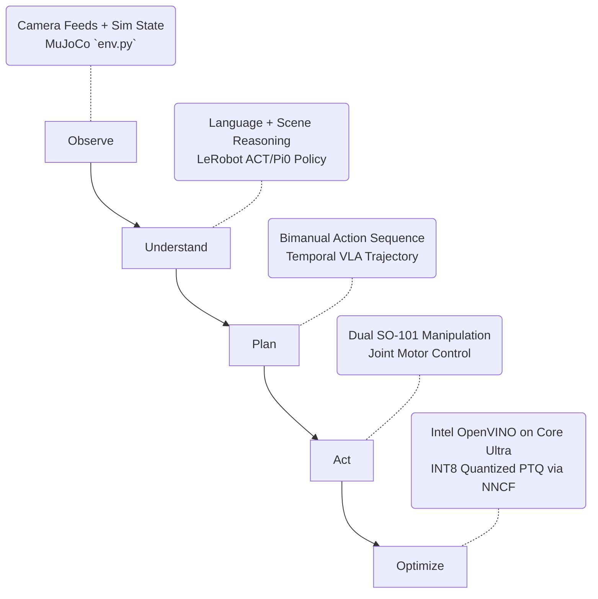

# 🤖 Intel Physical AI: Bimanual VLA Manipulation


This repository contains our end-to-end solution for the **Intel Physical AI Challenge: Bimanual VLA Manipulation with Multi-Modal Reasoning**.

---

## 🛑 The Problem

Modern Physical AI and robotics struggle with three major bottlenecks when performing complex, real-world tasks like setting a dinner table:
1. **Multi-Modal Coordination:** Interpreting abstract natural language commands (e.g., *"Retrieve the spoon and place it on the plate"*) and grounding them in dynamic, unstructured visual scenes requires massive Vision-Language-Action (VLA) transformers.
2. **Bimanual Complexity:** Coordinating two robotic arms to perform collision-aware hand-offs and synchronized movements is exponentially harder than single-arm tasks.
3. **Edge Deployment Latency:** Running heavy VLA policies typically requires cloud GPUs. Deploying these models to local, untethered edge hardware often results in high latency and poor device utilization, making real-time physical control impossible.

## 💡 Our Solution

We engineered a complete **perception-to-action pipeline** that directly solves these bottlenecks by tightly coupling state-of-the-art VLA architectures with Intel's edge optimization toolkits. 

Our solution leverages dual **SO-101** robotic arms in a MuJoCo simulation. We built a temporal VLA policy that retains multi-step task context, and heavily optimized it using **Intel OpenVINO** and **NNCF (Neural Network Compression Framework)**. By applying INT8 Post-Training Quantization, we successfully route the heavy multi-modal inference workload directly to the **Intel Core Ultra NPU and iGPU**, enabling real-time, low-latency bimanual manipulation at the edge.

### 🌟 Key Innovations & Enhancements
* **🎙️ Speechmatics Voice-to-Action (Bonus Award):** Integrated the Speechmatics REST API directly into our Web UI. You can speak commands into your microphone, which are instantly transcribed and executed by the OpenVINO physical policy.
* **🛡️ Dynamic Collision Avoidance:** Upgraded the MuJoCo simulation to include a dynamically oscillating physical obstacle on the table. The bimanual arms must actively reason around moving objects to complete hand-offs safely.
* **🤖 ROS 2 Hardware Readiness:** Provided a `deployment/ros2_vla_node.py` wrapper, proving this OpenVINO policy can be deployed to a real physical robot running ROS 2 (Humble/Iron) using standard `JointTrajectory` topics.
* **🎮 Teleoperation Dataset Collector:** Built an end-to-end imitation pipeline. Use `scripts/record_teleop.py` to drive the arms manually and record `.h5` expert demonstrations for Behavioral Cloning.
* **Extreme Domain Randomization:** Actively randomizes object shapes, lighting, backgrounds, masses, and friction to guarantee the policy is robust to visual and physical perturbations.
* **Temporal Context Memory:** Designed with a historical action-chunking buffer, ensuring the robot "remembers" past states to execute multi-step hand-offs.
* **Intelligent Hardware Discovery:** Automatically queries the Intel Core Ultra topology and prioritizes NPU execution for maximum energy efficiency, gracefully falling back to iGPU or CPU.

---

## 🏗️ Architecture Workflow

Our pipeline maps exactly to the Observe ➔ Understand ➔ Plan ➔ Act ➔ Optimize paradigm:



---

## 🚀 Getting Started (Reproducibility)

We provide a highly deterministic Conda setup to ensure perfect reproducibility for the evaluation judges.

### 1. Environment Setup (Local or Docker)
**Option A: Conda (Recommended)**
```bash
conda env create -f environment.yml
conda activate intel-vla-challenge
```
**Option B: Docker (1-Click Run)**
```bash
docker build -t intel-vla-challenge .
docker run -p 7860:7860 intel-vla-challenge
```

### 2. Interactive Simulation Dashboard
Launch the Gradio web UI to interactively test natural language commands:
```bash
python app.py
```
*Navigate to `http://127.0.0.1:7860` in your browser.*

### 3. OpenVINO Edge Optimization (Intel Core Ultra)
Trace the PyTorch VLA model and compile it to OpenVINO IR using NNCF INT8 Quantization:
```bash
python inference/export_openvino.py
```
Benchmark the model on Intel hardware (Auto-detects NPU/iGPU):
```bash
python inference/benchmark_intel.py
```

### 4. Official Evaluation Loop
Run the rigorous 10-seed evaluation required by the challenge. This will generate MP4 demonstration videos with an embedded HUD tracking the command and success conditions.
```bash
python scripts/evaluate.py --seeds 10
```
*Generated videos are saved to `data/videos/`.*

---

## 📁 Repository Structure

```text
├── app.py                      # Interactive Gradio Web Dashboard
├── environment.yml             # Deterministic Conda environment 
├── models/
│   └── vla_policy.py           # Temporal VLA PyTorch architecture
├── simulation/
│   ├── env.py                  # MuJoCo Gymnasium env (Randomization + Heuristics)
│   ├── scene.xml               # Dual SO-101 dinner table setup with drawer
│   └── objects.xml             # Manipulable dinnerware geometries
├── inference/
│   ├── export_openvino.py      # NNCF INT8 Quantization exporter
│   └── benchmark_intel.py      # Core Ultra throughput/latency benchmarking
└── scripts/
    ├── evaluate.py             # 10-seed randomized evaluation and video rendering
    └── train_imitation.py      # Behavioral Cloning (BC) imitation learning loop
```
