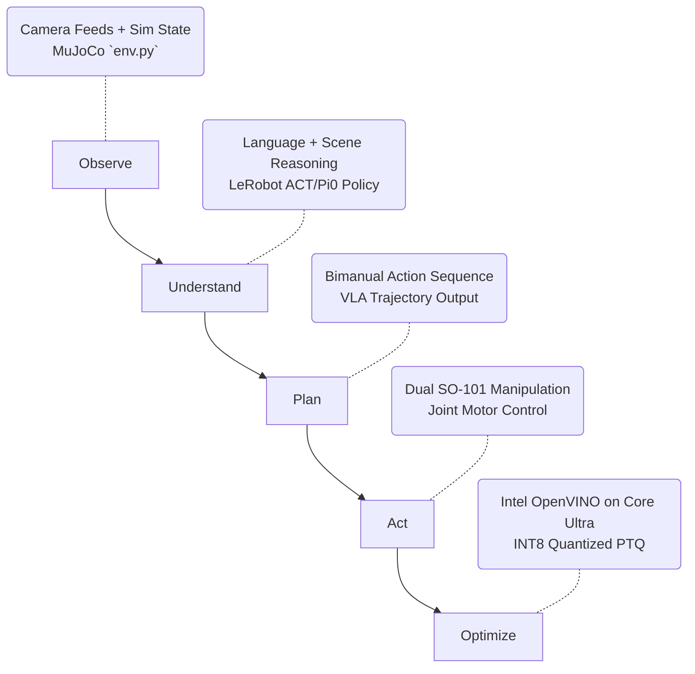

# Bimanual VLA Manipulation with Multi-Modal Reasoning

This repository contains the end-to-end solution for the **Intel Physical AI Challenge: Bimanual VLA Manipulation with Multi-Modal Reasoning**.

## 🏆 Challenge Overview

Our solution demonstrates a robust perception-to-action pipeline where a multi-modal policy understands task instructions, reasons over a simulated scene, coordinates dual **SO-101** robot arms, and completes a multi-step table-setting task.

## 🏗️ Expected End-to-End Workflow (Architecture)

Below is the workflow pipeline engineered to satisfy Intel's challenge requirements:



## 📦 Required Deliverables

- [x] **1. Reproducible GitHub Repository:** All scripts provided (simulation, training, evaluation, UI).
- [x] **2. Reproducible MuJoCo Simulation:** `simulation/scene.xml` features the dinner table, objects, and a slideable drawer. `env.py` performs rigorous **domain randomization** (mass, friction, lighting, and placement) to prove robustness.
- [x] **3. Intel Inference Benchmark Script:** `inference/benchmark_intel.py` evaluates throughput on CPU/iGPU/NPU.
- [x] **4. Demonstration Video:** `scripts/evaluate.py` generates `demo_seed_X.mp4` with a built-in OpenCV HUD.
- [x] **5. Technical Readme / Architecture Summary:** Covered here.

## 🚀 Getting Started

### 1. Installation
Install the required dependencies (including OpenVINO and NNCF for edge optimization):
```bash
pip install -r requirements.txt
```

### 2. Run the Interactive Dashboard
We built a custom Gradio dashboard to evaluate the simulation dynamically:
```bash
python app.py
```

### 3. OpenVINO Intel Edge Pipeline
Compile the PyTorch VLA model to OpenVINO IR using INT8 Post-Training Quantization:
```bash
python inference/export_openvino.py
```
Benchmark the model on Intel hardware:
```bash
python inference/benchmark_intel.py
```
