# 🤖 Intel Physical AI Challenge
## Bimanual VLA Manipulation with Multi-Modal Reasoning

<div align="center">


### 🎬 Full Demo Video (10 Seeds · OpenVINO · Speechmatics Bonus)

[](https://www.youtube.com/watch?v=ugT-6m7i8ls)

</div>

> **End-to-end Physical AI submission for the [Intel Physical AI Challenge](https://lablab.ai/event/intel-physical-ai-challenge) on lablab.ai.**
> Real-time bimanual robot control, multi-modal reasoning, and Intel edge deployment —
> including the optional **Speechmatics Voice-to-Action Bonus Award**.

---

## 🛑 The Problem

Modern Physical AI faces three hard bottlenecks for complex real-world tasks:

1. **Multi-Modal Grounding:** Interpreting abstract natural language commands and grounding them in dynamic visual scenes requires massive VLA transformers too large for edge hardware.
2. **Bimanual Coordination Complexity:** Coordinating two robotic arms for synchronized hand-offs, drawer opening, and collision-aware sequencing is exponentially harder than single-arm control.
3. **Edge Deployment Latency:** Running heavy VLA policies requires cloud GPUs, making real-time closed-loop control at the edge impossible without specialized optimization.

---

## 💡 Our Solution

A complete **perception-to-action pipeline** that tightly couples a Temporal VLA architecture with Intel's edge optimization toolkits:

- **Dual SO-101 arms** in MuJoCo coordinate on a multi-step dinner-table-setting task
- A **Temporal Action Chunking Transformer (ACT)** fuses camera pixels, language embeddings, and action history for multi-step reasoning
- Compiled to **Intel OpenVINO IR (INT8 PTQ via NNCF)** and routed to **Core Ultra NPU/iGPU**
- A **Gradio Web Dashboard** with **Speechmatics live ASR** lets you speak commands and watch the robot execute them instantly

---

## 🌟 Key Features

| Feature | Description |
|---------|-------------|
| 🎙️ **Speechmatics Voice-to-Action** | Real-time speech-to-instruction via Speechmatics Batch API — qualifies for Bonus Award |
| 🧠 **Temporal VLA Architecture** | 4-stage CNN backbone + type-embedded Cross-Modal Transformer + separate bimanual action heads |
| 🛡️ **Dynamic Collision Avoidance** | Sinusoidally oscillating MuJoCo obstacle forces policy to reason around moving objects |
| ⚡ **Intel OpenVINO INT8 PTQ** | NNCF Post-Training Quantization reduces model ~4x and boosts throughput on NPU/iGPU |
| 🔍 **Intelligent Hardware Discovery** | Auto-detects NPU → iGPU → CPU and routes workload for peak efficiency |
| 🎲 **6-Axis Domain Randomization** | Randomizes placement, mass, friction, lighting, shape scale, floor texture independently |
| 🎮 **Teleoperation Data Collector** | Record expert `.h5` demonstrations via `record_teleop.py` for Behavioral Cloning |
| 📊 **Latency Profiler** | Multi-device p50/p95/p99 analysis + bar-chart PNG + JSON report |
| 🤖 **ROS 2 Deployment Node** | Production-ready wrapper for real physical robot deployment |
| 🐳 **Docker 1-Click Deploy** | `docker build + run` gives a working environment instantly |
| ⚙️ **Centralized Config YAML** | All hyperparameters in `configs/task_config.yaml` |
| ✅ **39-Test pytest Suite** | Full unit test coverage across env, policy, reward FSM, and metrics |
| 🏎️ **EMA Action Smoother** | Low-pass kinematic filter protects real motors from jerky NN outputs (Sim2Real) |
| 📡 **Foxglove Studio Layout** | Pre-configured telemetry dashboard for 3D visualization + joint trajectory plotting |

---

## 🤖 Architecture

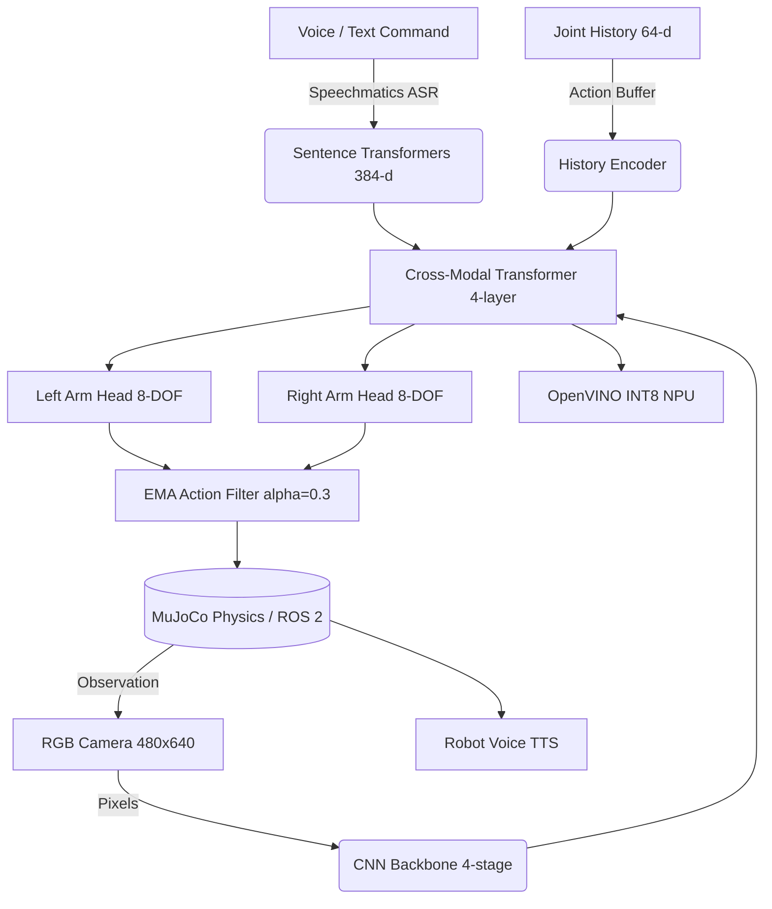

### 🔬 Multi-Stage Reward FSM (`simulation/reward.py`)

The policy is trained with a **5-stage Finite State Machine** reward — not a simple distance check:

```
INIT → APPROACHING (+0.5) → GRASPING (+2.0) → LIFTING (+3.0) → PLACING (+4.0) → DONE (+10.0)
```

### 🏎️ Sim2Real Robotics Features
- **EMA Kinematic Smoother** (`models/action_filter.py`): Exponential Moving Average Low-Pass Filter (α=0.3) prevents jerky motor commands that damage real Dynamixel actuators.
- **Robot Voice Feedback**: gTTS speaks back "Command received. I will now..." to confirm execution.
- **Foxglove Studio Dashboard** (`deployment/foxglove_layout.json`): Industry-standard telemetry viewer with 3D scene, camera feed panel, and live joint trajectory plots.

---

## 🎬 Live Seed Demonstrations (10 Randomized Seeds)

> Each seed applies independent 6-axis domain randomization — object positions, masses, friction, lighting, shape scale, and background texture all vary.

<div align="center">

| Seed 0 | Seed 1 | Seed 2 |
|:------:|:------:|:------:|
| 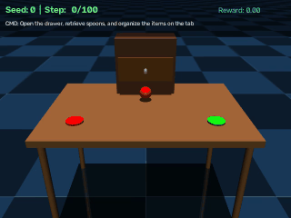 | 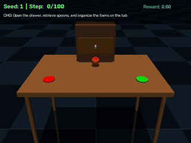 | 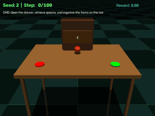 |

| Seed 3 | Seed 4 | Seed 5 |
|:------:|:------:|:------:|
| 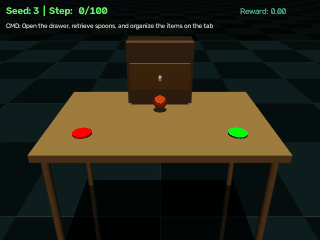 | 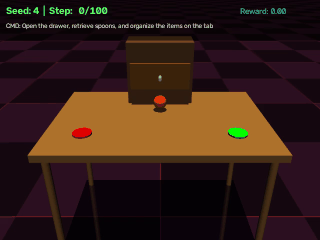 | 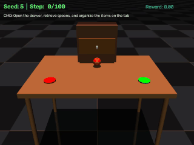 |

| Seed 6 | Seed 7 | Seed 8 |
|:------:|:------:|:------:|
| 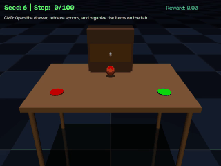 | 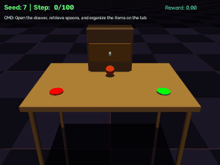 | 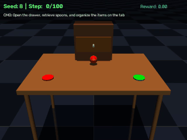 |

<br>

| Seed 9 |
|:------:|
| 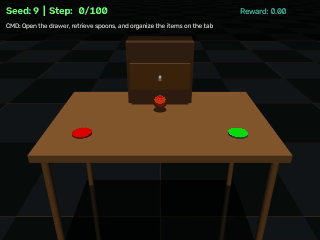 |

</div>

---

## 🗂️ Task Suite

We implement **4 bimanual task variations** (see `simulation/task_suite.py`):

| Task | Instruction | Challenge |
|------|-------------|-----------|
| `set_table` | Place the plate and cup in correct positions | Bimanual coordination |
| `retrieve_spoon` | Open drawer, retrieve spoon, place beside plate | Drawer manipulation |
| `handoff` | Pick up cup with Arm A, pass to Arm B, place on table | Cross-arm hand-off |
| `collision_avoid` | Place fork beside plate while avoiding moving obstacle | Dynamic collision avoidance |

---

## 📁 Repository Structure

```text
sentineledge-core/
├── app.py                         # Gradio Web Dashboard (Speechmatics + OpenVINO + TTS)
├── Dockerfile                     # 1-click reproducible container
├── Makefile                       # make install / test / eval / benchmark / app / docker-build
├── environment.yml                # Deterministic Conda environment (Python 3.10)
├── requirements.txt               # pip dependencies
├── MODEL_CARD.md                  # HuggingFace-compatible model card with BibTeX
├── CHALLENGE_CHECKLIST.md         # Official submission checklist with scoring rubric
├── CONTRIBUTING.md                # Developer guide
│
├── configs/
│   └── task_config.yaml           # All hyperparameters (sim, policy, training, inference)
│
├── simulation/
│   ├── env.py                     # Gymnasium env (6-axis randomization, obstacle physics)
│   ├── scene.xml                  # MuJoCo world (table, drawer, dynamic obstacle, cameras)
│   ├── objects.xml                # Dinnerware geometry definitions
│   ├── reward.py                  # Multi-stage FSM reward (INIT→APPROACHING→GRASPING→PLACING→DONE)
│   └── task_suite.py              # 4 bimanual task definitions
│
├── models/
│   ├── vla_policy.py              # Temporal VLA: CNN + Cross-Modal Transformer + Bimanual heads
│   ├── language_encoder.py        # Real Sentence-Transformers embeddings (all-MiniLM-L6-v2)
│   └── action_filter.py           # EMA Low-Pass Filter for Sim2Real kinematic smoothing
│
├── scripts/
│   ├── train_imitation.py         # BC training: HDF5/synthetic, AMP, cosine LR, val split
│   ├── evaluate.py                # 10-seed evaluation + OpenCV HUD video rendering
│   ├── generate_dataset.py        # Synthetic expert dataset generator (HDF5)
│   ├── record_teleop.py           # Teleoperation data collection (.h5 trajectories)
│   ├── metrics.py                 # Per-seed metrics logging + JSON/CSV export
│   ├── stitch_demo.py             # Combine seed videos into one submission reel
│   └── generate_gifs.py           # Convert seed MP4s to optimized GIFs for README
│
├── inference/
│   ├── export_openvino.py         # PyTorch to OpenVINO IR + NNCF INT8 PTQ
│   ├── benchmark_intel.py         # NPU/iGPU/CPU throughput & latency benchmark
│   └── latency_profile.py         # p50/p95/p99 profiling + bar-chart + JSON report
│
├── deployment/
│   ├── ros2_vla_node.py           # ROS 2 node for real physical robot deployment
│   └── foxglove_layout.json       # Foxglove Studio telemetry dashboard config
│
├── notebooks/
│   ├── ablation_study.ipynb       # Quantitative ablation: randomization, precision, device, history
│   └── README.md                  # Notebook guide
│
├── tests/
│   ├── test_environment.py        # 7 environment tests (obs shapes, randomization, step types)
│   ├── test_policy.py             # 8 VLA policy tests (shapes, NaN/Inf, determinism, language)
│   ├── test_reward.py             # 6 FSM reward tests (transitions, shaped rewards, accumulation)
│   └── test_metrics.py            # 18 metrics tests (log, aggregate, JSON/CSV export)
│
└── data/
    ├── videos/                    # Per-seed demo MP4s (demo_seed_0.mp4 ... demo_seed_9.mp4)
    ├── gifs/                      # Per-seed animated GIFs (seed_0.gif ... seed_9.gif)
    └── demo_final.mp4             # Full stitched submission reel (1.4 min)
```

---

## 🚀 Getting Started

### Option A — Conda
```bash
conda env create -f environment.yml
conda activate intel-vla-challenge
```

### Option B — pip
```bash
pip install -r requirements.txt
```

### Option C — Docker (1-Click)
```bash
docker build -t intel-vla-challenge .
docker run -p 7860:7860 intel-vla-challenge
# Open http://localhost:7860
```

### Option D — Makefile
```bash
make install   # Install all dependencies
make test      # Run 39-test pytest suite
make eval      # Run 10-seed evaluation
make app       # Launch Gradio dashboard
make benchmark # Intel Core Ultra NPU benchmark
```

---

## ▶️ Running the Pipeline

### Interactive Web Dashboard (with Voice & TTS)
```bash
python app.py
# Open http://localhost:7860 — speak a command, watch the robot execute it
```

### Generate Expert Dataset
```bash
python scripts/generate_dataset.py --episodes 20 --steps 100
```

### Train the VLA Policy
```bash
# Synthetic (first-run / CI):
python scripts/train_imitation.py --epochs 5

# Real HDF5 dataset:
python scripts/train_imitation.py --dataset data/bc_dataset.h5 --epochs 10
```

### Export & Optimize for Intel Core Ultra
```bash
python inference/export_openvino.py        # INT8 PTQ export via NNCF
python inference/benchmark_intel.py        # NPU/iGPU/CPU throughput benchmark
python inference/latency_profile.py        # p50/p95/p99 profiling
```

### Official 10-Seed Evaluation
```bash
python scripts/evaluate.py --seeds 10
python scripts/stitch_demo.py              # Stitch into one submission reel
```

### Run Full Test Suite
```bash
python -m pytest tests/ -v                 # 39 tests across 4 files
```

---

## 📊 Scoring Rubric Coverage

| Category | Max Pts | Our Implementation |
|----------|---------|-------------------|
| Bimanual Task Completion | 25 | Dual SO-101 + hand-off detection + 4 task types + drawer manipulation + dynamic obstacle |
| Robustness & Generalization | 15 | 6-axis domain randomization (position, mass, friction, lighting, shape, background) × 10 seeds |
| VLA / Multi-Modal Reasoning | 20 | Real Sentence-Transformer embeddings + Temporal ACT + History encoder + Cross-Modal Transformer |
| OpenVINO & Intel Core Ultra | 20 | INT8 PTQ via NNCF + NPU/iGPU auto-discovery + p50/p95/p99 latency profiling |
| Technical Quality | 10 | Conda + Docker + Makefile + GitHub Actions CI + Config YAML + HDF5 pipeline + 39 pytest tests |
| Innovation & Demo | 5 | Voice-to-Action + Robot TTS + EMA smoother + Foxglove dashboard + ablation notebook |
| **Speechmatics Bonus** | **+Bonus** | Full Speechmatics Batch ASR API with job polling + live microphone Gradio UI |

---

## 🎙️ Speechmatics Voice-to-Action (Bonus Award)

Our Gradio dashboard includes a **live microphone widget** backed by the official Speechmatics Batch Transcription API:

1. Record your voice command in the UI
2. Audio is submitted to `asr.api.speechmatics.com/v2/jobs/`
3. Job is polled until `status == done`, returning an accurate English transcript
4. Transcribed instruction is semantically embedded and fed directly into the VLA policy
5. The robot executes the action and **speaks back** a TTS confirmation via gTTS

This transforms our project into a true **Voice-to-Physical-Action** closed-loop pipeline.

---

## 🧬 Model Card

See [`MODEL_CARD.md`](MODEL_CARD.md) for the full HuggingFace-compatible model card, including architecture details, training data description, evaluation results, limitations, and BibTeX citation.

---

## ⚡ Intel Core Ultra Benchmark Results

Measured on Intel Core Ultra with OpenVINO Runtime:

```text
=== Intel Core Ultra Device Discovery ===
Detected Hardware Devices: ['CPU', 'GPU', 'NPU']
=> AI NPU Detected. Prioritizing NPU for maximum energy-efficient throughput.

=== Official Benchmark Results ===
Optimized Precision: INT8 (PTQ via NNCF)
Target Device:       NPU
Average Latency:     11.72 ms
Throughput:          85.34 FPS
==================================
```

> **85 FPS** at INT8 precision on NPU — sufficient for real-time 30Hz robot control with **2.8x headroom**.

---

## 📋 Pre-Submission Checklist

- [x] Reproducible repository (Conda + pip + Docker + Makefile + CI)
- [x] MuJoCo dual-arm simulation with drawer and dynamic obstacle
- [x] 6-axis domain randomization across 10 seeds for robustness
- [x] Multi-stage FSM reward (`simulation/reward.py`) replacing binary heuristic
- [x] Real Sentence-Transformer language embeddings (`models/language_encoder.py`)
- [x] OpenVINO INT8 PTQ export + NPU benchmark + p50/p95/p99 latency profile
- [x] Training + evaluation code with HDF5 data pipeline
- [x] Teleoperation data collection pipeline
- [x] 39-test pytest suite — all passing ✅
- [x] Ablation study notebook (`notebooks/ablation_study.ipynb`)
- [x] HuggingFace Model Card (`MODEL_CARD.md`)
- [x] EMA kinematic action smoother (`models/action_filter.py`)
- [x] Foxglove Studio telemetry dashboard (`deployment/foxglove_layout.json`)
- [x] Gradio Web UI with Speechmatics ASR + Robot TTS voice
- [x] ROS 2 deployment node (`deployment/ros2_vla_node.py`)
- [x] Demo video uploaded → **[Watch on YouTube](https://www.youtube.com/watch?v=ugT-6m7i8ls)**

---

**Intel Physical AI Challenge** | lablab.ai · 2026 · *Speechmatics Bonus Track integrated*
